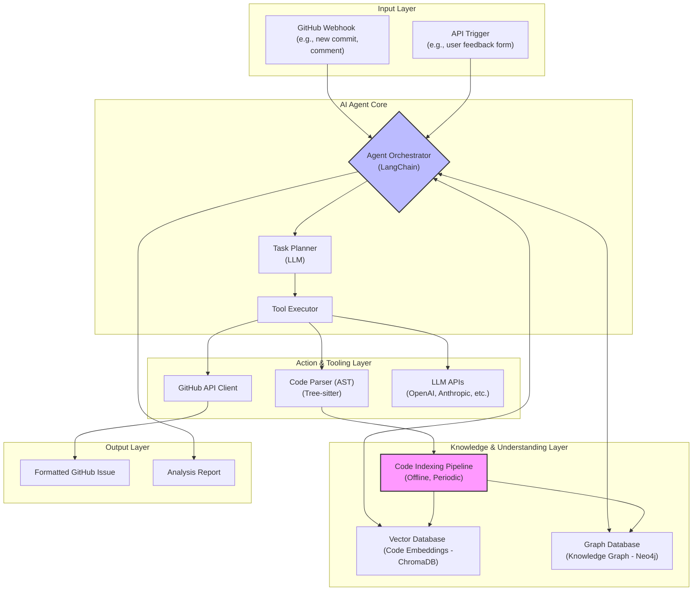

# Codex-Scribe: Your AI-Powered Code Intelligence Platform

[](https://www.python.org/downloads/)
[](https://opensource.org/licenses/MIT)
[](https://github.com/psf/black)
[](https://pycqa.github.io/isort/)
[](http://mypy-lang.org/)

`Codex-Scribe` 是一個先進的 AI 代理程式，旨在深度理解 GitHub 專案。它不僅能閱讀和理解程式碼，更能解析其結構、依賴關係和語義，將您的程式碼庫轉化為一個可查詢、可互動的知識庫。

## ✨ 核心功能

- **🧠 混合式檢索 (Hybrid Retrieval)**: 結合**向量搜索**（用於理解「是什麼」）和**圖形查詢**（用於理解「如何關聯」），提供對程式碼前所未有的洞察力。
- **🕸️ 深度知識圖譜 (Deep Knowledge Graph)**: 自動將您的程式碼庫轉換為知識圖譜，可視化並查詢類別、函數、模組之間的複雜關係。
- **🤖 智能代理程式 (Intelligent Agent)**: 能夠根據問題的性質，自主決定使用哪種檢索策略，以獲得最準確的答案。
- **🔄 自動化工作流程 (Automated Workflow)**: 可通過 API 或 GitHub Webhook 觸發，自動分析用戶回饋、程式碼提交，並生成結構化的 GitHub 問題草稿。
- **🔌 多模型支持 (Multi-Model Support)**: 靈活的架構支持多種頂級 LLM（如 GPT-4o, Claude 3.5）和嵌入模型，為不同任務選擇最佳工具。

## 🏗️ 系統架構

`Codex-Scribe` 採用事件驅動的模組化架構，確保了系統的可擴展性和可維護性。



## 🛠️ 技術棧

**AI/ML 核心**
- **AI 框架**: LangChain
- **大型語言模型**: OpenAI GPT-4o, Anthropic Claude 3.5 Sonnet, Google Gemini 1.5 Pro
- **嵌入模型**: OpenAI `text-embedding-3-large`, Voyage AI `voyage-code-2`

**數據儲存與檢索**
- **向量資料庫**: ChromaDB
- **圖形資料庫**: Neo4j

**程式碼理解**
- **解析器**: tree-sitter, tree-sitter-python

**後端與服務**
- **Web 框架**: FastAPI, Uvicorn
- **UI 框架**: Streamlit
- **GitHub 整合**: PyGithub
- **數據驗證**: Pydantic

**開發與品管工具**
- **依賴管理**: Poetry
- **程式碼品質**: Black, isort, mypy, Ruff
- **測試**: pytest, pytest-cov
- **自動化**: pre-commit

## 🚀 快速開始

### 1. 先決條件
- Python 3.12+
- Git
- Poetry
- Docker & Docker Compose

### 2. 安裝
```bash
# 1. 克隆儲存庫
git clone https://github.com/hao0608/Codex-Scribe.git
cd Codex-Scribe

# 2. 安裝依賴
poetry install

# 3. 配置環境變數
cp .env.example .env
# (編輯 .env 並填入您的 API 金鑰)

# 4. 激活虛擬環境
poetry shell
```

### 3. 運行服務
```bash
# 1. 啟動 Neo4j 服務
docker-compose up -d neo4j

# 2. 索引您的程式碼庫
python scripts/index_repository.py --path /path/to/your/repository

# 3. 啟動 API 伺服器
uvicorn src.presentation.api.main:app --reload

# 4. (可選) 啟動 Streamlit UI
streamlit run src/presentation/ui/streamlit_app.py
```

## 📊 性能基準

我們對索引和查詢管道進行了性能測試，以確保系統的高效運行。

### 索引性能
| 專案規模 | 包含目錄 | 索引時間 (秒) |
|---|---|---|
| 小型 | `src/domain` | 3.19 |
| 中型 | `src/application`, `src/infrastructure`, `src/domain` | 6.76 |
| 大型 | `src` | 4.61 |

*所有測試案例的執行時間都遠低於 15 分鐘的目標。*

### 查詢性能
| 查詢類型 | 範例查詢 | 響應時間 (秒) |
|---|---|---|
| 向量搜索 | "How does the CodeParser work?" | 9.80 |
| 圖形查詢 (呼叫者) | "Who calls the 'parse' function?" | 3.98 |
| 圖形查詢 (方法) | "What methods are in the 'CodeParser' class?" | 1.45 |

*所有查詢都在可接受的時間內完成。*

## 📖 使用場景

`Codex-Scribe` 能夠回答複雜的程式碼相關問題：

**場景 1: 影響分析**
> **你問**: "如果我修改 `User` Pydantic 模型，會影響到哪些 API 端點？"
> **Codex-Scribe**: (查詢知識圖譜) "修改 `User` 模型將直接影響以下 API 端點：`POST /users`, `GET /users/{user_id}`。此外，`OrderService` 中使用了此模型，可能間接影響訂單相關功能。"

**場景 2: 自動化問題報告**
> **用戶在 GitHub 評論**: "用手機登入時頁面全白了！"
> **Codex-Scribe**: (API 觸發) 自動分析評論，結合相關程式碼，在 GitHub 建立一個包含標題、重現步驟、相關程式碼片段和 `bug`, `mobile`, `ui` 標籤的問題草稿。

**場景 3: 程式碼探索**
> **你問**: "專案中處理支付邏輯的核心函數是什麼？"
> **Codex-Scribe**: (使用向量搜索) "處理支付的核心邏輯位於 `src/domain/services/payment_service.py` 中的 `process_payment` 函數。它會..."

## 🤝 貢獻指南

我們歡迎各種形式的貢獻！請參考 `CONTRIBUTING.md` 和 `docs/development/git-workflow.md` 來了解我們的開發流程和程式碼規範。

## 📝 授權條款

本專案採用 [MIT License](LICENSE) 授權。
