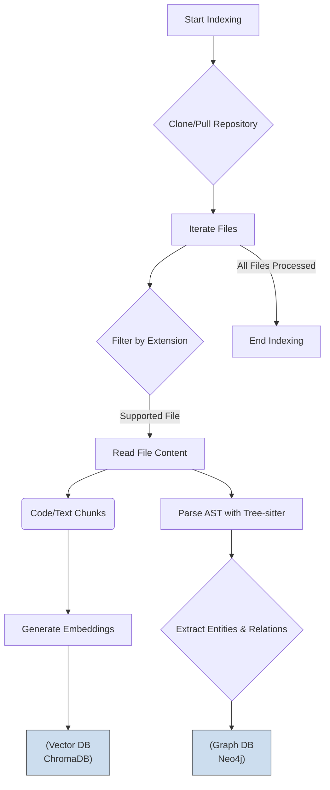

# Data Flow and Processing

## 1. 概述

本文件詳細描述了 `Codex-Scribe` 系統中的數據流動和處理管道。它解釋了數據如何從輸入源進入系統，經過各個組件的處理和轉換，最終生成輸出。

**目標讀者**: 開發者、架構師。

## 2. 主要數據流

本系統有兩個主要的數據流：

1.  **離線索引流 (Offline Indexing Flow)**: 定期運行，負責處理整個程式碼庫並建立知識庫。
2.  **在線查詢流 (Online Query Flow)**: 由用戶請求觸發，負責處理單個查詢並生成回應。

## 3. 離線索引流

此流程的目標是將非結構化的程式碼庫轉換為 AI 可查詢的結構化知識庫（向量數據庫和圖形資料庫）。



**步驟詳解**:

1.  **觸發 (Trigger)**: 此流程可由 GitHub Actions 的定時任務 (`schedule`) 或手動執行腳本觸發。
2.  **獲取程式碼**: 系統首先從 `https://github.com/hao0608/Codex-Scribe` 克隆或拉取最新的程式碼。
3.  **文件過濾**: 遍歷所有文件，只選擇支持的擴展名（如 `.py`, `.md`）進行處理。
4.  **文本分割**: 將文件內容分割成有意義的、大小適中的文本塊 (chunks)。
5.  **向量化 (Vectorization)**:
    - 對每個文本塊，使用 OpenAI 的嵌入模型生成一個高維向量。
    - 將文本塊的內容（作為 metadata）和其對應的向量存入 **ChromaDB**。
6.  **結構化解析 (AST Parsing)**:
    - 對每個程式碼文件，使用 **Tree-sitter** 解析其內容，生成抽象語法樹。
    - 從 AST 中提取結構化信息，如類定義、函數定義、導入和函數調用。
7.  **圖譜構建 (Graph Construction)**:
    - 將提取出的實體（文件、類、函數）作為**節點**，它們之間的關係（包含、導入、調用）作為**邊**，存入 **Neo4j**。

## 4. 在線查詢流

此流程在接收到用戶請求時觸發，利用已建立的知識庫來生成答案。

```mermaid
graph TD
    subgraph User Request
        A[User Query via API/UI]
    end

    subgraph AI Core
        B{Agent Orchestrator}
        C{Task Planner}
        D[Tool Executor]
    end

    subgraph Knowledge Sources
        E[(Vector DB)]
        F[(Graph DB)]
    end
    
    subgraph External Services
        G[LLM API]
    end

    subgraph System Response
        H[Formatted Output\n(GitHub Issue, JSON, Text)]
    end

    A --> B;
    B --> C;
    C --> D;
    D -- Vector Search --> E;
    D -- Graph Query --> F;
    E -- Relevant Chunks --> B;
    F -- Structural Info --> B;
    B -- Formatted Prompt --> G;
    G -- Generated Response --> B;
    B --> H;
```

**步驟詳解**:

1.  **接收請求**: 系統通過 FastAPI 端點或 Streamlit UI 接收到一個自然語言查詢。
2.  **任務規劃**: **Agent Orchestrator** 將查詢傳遞給 **Task Planner**。Planner (LLM) 分析查詢意圖，並決定需要執行哪些步驟。
    - *範例*: 如果問題是 "How does authentication work?"，Planner 可能決定只需要進行向量搜索。
    - *範例*: 如果問題是 "What happens if I change the User model?"，Planner 可能決定需要先進行圖形查詢找到依賴，再對相關文件進行向量搜索。
3.  **工具執行**: **Tool Executor** 根據 Planner 的指令調用相應的工具。
    - **向量搜索**: 將用戶查詢轉換為向量，在 ChromaDB 中查找最相似的程式碼塊。
    - **圖形查詢**: 將查詢轉換為 Cypher 語句，在 Neo4j 中查找結構關係。
4.  **上下文整合**: Orchestrator 收集來自工具的結果（程式碼塊、依賴列表等），並將它們與原始查詢一起組合成一個豐富的提示 (prompt)。
5.  **LLM 生成**: 將此提示發送給 OpenAI GPT-4o。
6.  **輸出處理**: LLM 返回的結果會經過一個輸出解析器（如 `PydanticOutputParser`）的處理，以確保其格式正確，然後返回給用戶或用於下一步操作（如建立 GitHub issue）。

## 5. 更新記錄

| 日期       | 版本 | 更新內容           | 更新人 |
|------------|------|--------------------|--------|
| 2025-07-24 | 1.0  | 初始版本建立       | Cline  |
