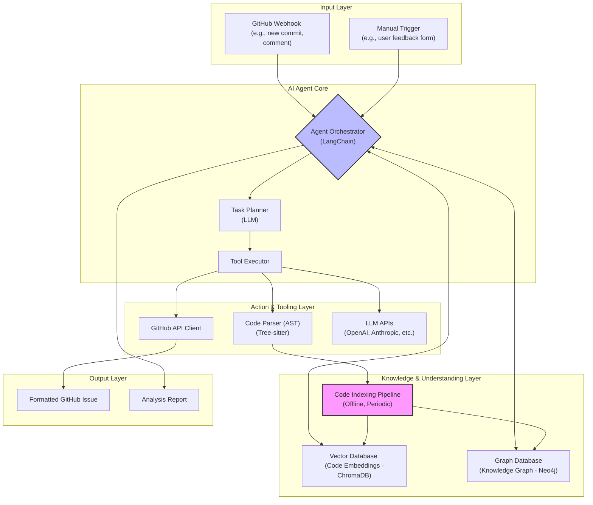

# System Overview

## 1. 概述

本文件提供了 `Codex-Scribe` 專案的整體系統架構設計。它描述了系統的主要組件、它們之間的交互方式以及數據如何在系統中流動。

**目標讀者**: 開發者、架構師和對系統設計感興趣的相關人員。

## 2. 架構設計原則

- **模組化 (Modular)**: 系統被劃分為獨立、可重用的模組，每個模組都有明確定義的職責。
- **事件驅動 (Event-Driven)**: 系統的核心操作由外部或內部事件觸發，實現了組件之間的鬆耦合。
- **可擴展性 (Scalable)**: 架構設計考慮了未來的擴展需求，可以輕鬆添加新的功能模組、AI 模型或數據源。
- **可測試性 (Testable)**: 採用乾淨架構 (Clean Architecture) 原則，將核心業務邏輯與外部框架和基礎設施分離，使其易於測試。

## 3. 概念架構圖

## 4. 組件說明

### 4.1 輸入層 (Input Layer)
- **GitHub Webhook**: 自動觸發器，監聽 GitHub 儲存庫的特定事件（如 `issue_comment`, `push`）。
- **手動觸發 (Manual Trigger)**: 允許用戶通過 UI（如 Streamlit 應用）或 API 提交分析請求。

### 4.2 AI 代理程式核心 (AI Agent Core)
- **協調器 (Agent Orchestrator)**: 系統的大腦，基於 **LangChain** 框架。負責接收任務、理解意圖並協調其他組件。
- **任務規劃器 (Task Planner)**: 使用 LLM 將高層次目標分解為具體、可執行的步驟序列。
- **工具執行器 (Tool Executor)**: 根據規劃器的指令，調用並執行一個或多個工具。

### 4.3 知識與理解層 (Knowledge & Understanding Layer)
- **程式碼索引管道 (Code Indexing Pipeline)**: 一個離線的、定期運行的程序，負責掃描目標程式碼庫，解析程式碼 (AST)，生成嵌入，並構建知識圖譜。
- **向量資料庫 (Vector Database)**: 使用 **ChromaDB** 儲存程式碼的向量嵌入，用於快速語義搜索。
- **圖形資料庫 (Graph Database)**: 使用 **Neo4j** 儲存程式碼的結構化知識（類、函數、依賴關係），用於關係查詢。

### 4.4 行動與工具層 (Action & Tooling Layer)
- **GitHub API 客戶端**: 封裝了與 GitHub REST API 的互動，用於讀取文件、建立 issue 等。
- **程式碼解析器 (Code Parser)**: 使用 **Tree-sitter** 將程式碼文本轉換為抽象語法樹 (AST)。
- **LLM APIs**: 與外部大型語言模型服務（如 OpenAI）進行通信的客戶端。

### 4.5 輸出層 (Output Layer)
- **格式化的 GitHub Issue**: 系統的主要輸出之一，包含標題、內容、標籤和相關程式碼片段。
- **分析報告**: 對於複雜的查詢，系統可以生成一份詳細的分析報告。

## 5. 更新記錄

| 日期       | 版本 | 更新內容           | 更新人 |
|------------|------|--------------------|--------|
| 2025-07-24 | 1.0  | 初始版本建立       | Cline  |
