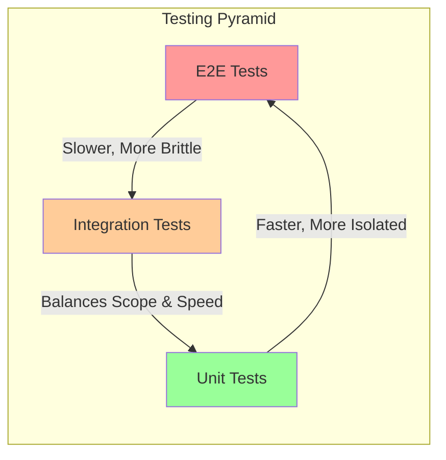

# Testing Strategy

## 1. 概述

本文件定義了 `Codex-Scribe` 專案的測試策略和質量保證體系。一個全面的測試策略對於確保系統的可靠性、準確性和可維護性至關重要。

**目標讀者**: 開發者、QA 工程師。

## 2. 測試層次

本專案採用測試金字塔模型，涵蓋不同層次的測試。

### 2.1 單元測試 (Unit Tests)

- **目標**: 測試單個函式、方法或類別的邏輯是否正確，與外部依賴（如數據庫、API）隔離。
- **框架**: `pytest`
- **工具**: `unittest.mock` 用於模擬 (mock) 外部依賴。
- **位置**: `tests/unit`
- **要求**:
    - 核心業務邏輯（`src/domain`, `src/application`）必須有高覆蓋率的單元測試。
    - 測試應快速、獨立且可重複。
- **範例**: 測試一個文本分割器函式是否能正確處理不同長度的文本。

### 2.2 整合測試 (Integration Tests)

- **目標**: 測試多個組件協同工作時是否正確。
- **框架**: `pytest`
- **工具**:
    - `docker-compose` 用於啟動真實的數據庫服務（ChromaDB, Neo4j）。
    - `pytest-https-server` 或類似工具用於模擬外部 API 服務。
- **位置**: `tests/integration`
- **要求**:
    - 測試數據庫服務（如 `Neo4jService`）能否成功連接和查詢。
    - 測試 RAG 鏈能否從真實的向量數據庫中檢索數據並與 LLM API 互動。
    - 測試 FastAPI 端點能否正確調用應用層的 use cases。
- **範例**: 測試完整的索引管道，從讀取文件到寫入向量數據庫和圖形資料庫。

### 2.3 端到端測試 (End-to-End Tests)

- **目標**: 從用戶的角度模擬完整的工作流程，驗證整個系統是否符合預期。
- **框架**: `pytest` 結合 `requests` (用於 API) 和 `selenium` 或 `playwright` (用於 UI)。
- **位置**: `tests/e2e`
- **要求**:
    - 測試應覆蓋最關鍵的用戶場景。
    - 測試數量應較少，因為它們運行緩慢且維護成本高。
- **範例**:
    - **API E2E**: 發送一個請求到 `/api/v1/analyses`，然後輪詢 `/api/v1/analyses/{task_id}` 端點，直到任務完成，最後驗證在 GitHub 上是否已成功建立 issue。
    - **UI E2E**: 自動化瀏覽器打開 Streamlit 應用，輸入一個問題，點擊提交，並驗證頁面上是否顯示了預期格式的答案。

## 3. AI/LLM 特定的測試

測試基於 LLM 的系統有其獨特的挑戰。

### 3.1 提示模板測試
- **目標**: 確保提示模板能夠正確地格式化和注入變數。
- **方法**: 使用單元測試，提供假的變數，驗證生成的提示字串是否符合預期。

### 3.2 輸出解析器測試
- **目標**: 確保輸出解析器能夠處理有效和無效的 LLM 輸出。
- **方法**:
    - **有效輸出**: 提供一個符合預期格式的假 LLM 輸出，驗證解析器能否成功解析。
    - **無效輸出**: 提供格式錯誤或不完整的輸出，驗證解析器是否能優雅地處理錯誤（例如，拋出特定異常或嘗試修復）。

### 3.3 評估 (Evaluation)
- **目標**: 定量評估 RAG 系統的回答品質。
- **框架**: LangChain 提供了評估工具（如 `Ragas`）。
- **方法**:
    - **建立評估集**: 創建一組 "問題-標準答案" 對。
    - **指標**:
        - **Faithfulness**: 回答是否忠於提供的上下文。
        - **Answer Relevancy**: 回答是否與問題相關。
        - **Context Precision/Recall**: 檢索到的上下文是否準確和全面。
    - **流程**: 定期在評估集上運行系統，計算上述指標，以追蹤模型或提示變更帶來的影響。

## 4. CI/CD 整合

- **工具**: GitHub Actions
- **工作流程 (`.github/workflows/ci.yml`)**:
    - **觸發器**: 在對 `develop` 分支的 `push` 或 `pull_request` 時觸發。
    - **步驟**:
        1.  設置 Python 環境。
        2.  安裝依賴 (`poetry install`)。
        3.  運行代碼質量檢查 (`black --check`, `isort --check`, `mypy`).
        4.  運行單元測試 (`pytest tests/unit`)。
        5.  運行整合測試 (`pytest tests/integration`)。
    - **要求**: 所有步驟都必須通過，PR 才能被合併。

## 5. 更新記錄

| 日期       | 版本 | 更新內容           | 更新人 |
|------------|------|--------------------|--------|
| 2025-07-24 | 1.0  | 初始版本建立       | Cline  |
